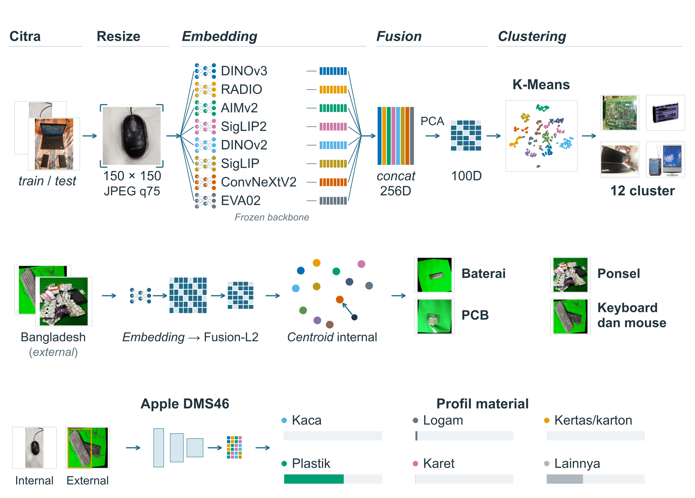

# BDC e-waste research

## Tim

| No. | Nama | Peran |
|---:|---|---|
| 1 | ARYA PRATAMA RHAMA PUTRA | Anggota |
| 2 | FAIZ AKBAR HIZBULLAH | Anggota |
| 3 | RADITYA AKMAL | Anggota |
|  | Aldinata Rizky Revanda | Pembimbing |

## Pipeline



## Struktur repository

```text
.
├── figures/
│   ├── pipeline.png — preview pipeline
│   └── pipeline.svg — file vector pipeline
├── notebooks/
│   └── 01_hasil_penelitian.ipynb — ringkasan hasil dan visualisasi
├── results/
│   ├── acquisition.csv — hasil penanganan ukuran dan JPEG
│   ├── k_selection.csv — hasil pemilihan K
│   ├── k_stability.csv — hasil 100 seed
│   ├── cluster_stability.csv — stabilitas tiap cluster
│   ├── external_transfer_metrics.csv — metrik transfer perangkat
│   ├── external_transfer_predictions.csv — prediksi citra Bangladesh
│   ├── material_holdout.csv — evaluasi material pada holdout internal
│   ├── material_per_material.csv — metrik per material internal
│   ├── cluster_material_profiles.csv — profil material per cluster
│   ├── external_material_metrics.json — ringkasan DMS46 external
│   └── external_material_by_class.csv — metrik DMS46 per material
├── src/
│   └── bdc/
│       ├── __init__.py
│       ├── config.py — konfigurasi backbone dan parameter
│       ├── preprocessing.py — preprocessing ukuran dan JPEG
│       ├── embeddings.py — embedding
│       ├── clustering.py — fusion, PCA, dan K-Means
│       ├── material.py — inference DMS46 dan profil material
│       ├── evaluation.py — metrik stabilitas, transfer, dan material
│       └── visualization.py — visualisasi hasil
├── requirements.txt — dependensi
└── .gitignore
```
