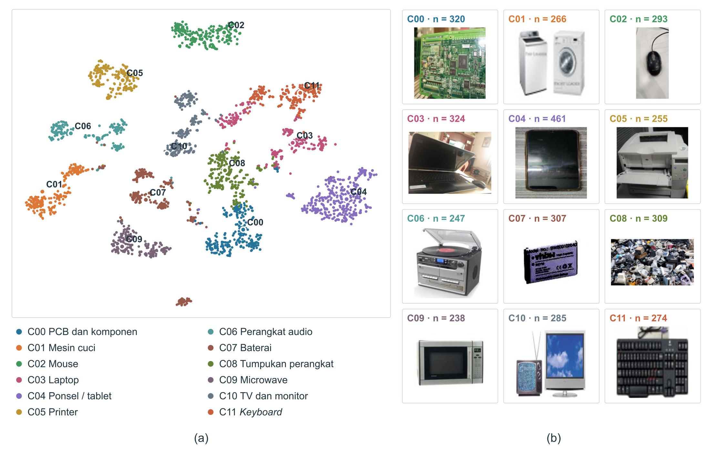
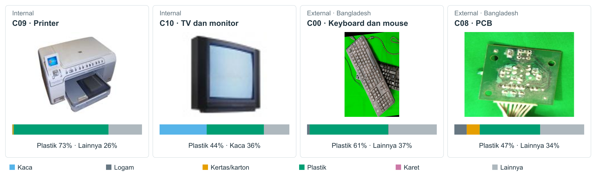

# BDC e-waste research

## Tim

| No. | Nama | Peran |
|---:|---|---|
| 1 | ARYA PRATAMA RHAMA PUTRA | Anggota |
| 2 | FAIZ AKBAR HIZBULLAH | Anggota |
| 3 | RADITYA AKMAL | Anggota |
|  | Aldinata Rizky Revanda | Pembimbing |

## Pipeline


## Dataset

| Sumber | Jumlah | Rincian |
|---|---:|---|
| Data internal BDC| 4.179 citra | 3.979 citra *train* berlabel *Electronic* dan 200 citra *test* yang masuk berdasarkan prediksi model sebagai *Electronic*. |
| Bangladesh (*external*) | 2.157 berkas | Dataset [*Custom Bangladeshi E-Waste Image Dataset for Object Detection and Recognition*](https://doi.org/10.17632/77383kmdnw.1) oleh Afrin dan Azmi (2025). Sebanyak 2.153 berkas memiliki anotasi. Dari jumlah itu, 710 citra masuk ke empat kelompok perangkat yang dapat dipetakan, yaitu baterai, PCB, ponsel, serta *keyboard* dan *mouse*; 1.443 citra lain berada di luar empat kelompok tersebut. Empat berkas tanpa anotasi tidak digunakan. Lisensi CC BY 4.0. |


## Hasil *clustering*



Sebaran K=12 ditampilkan sebagai proyeksi 2D untuk visualisasi. Citra di sisi kanan adalah contoh terdekat ke *centroid* pada ruang *embedding* 100-D. Nama kelompok merangkum pola citra, bukan label acuan.

## Profil material DMS46



Profil menunjukkan prediksi enam kelas visual, yaitu kaca, logam, kertas/karton, plastik, karet, dan lainnya. Nilainya menggambarkan area yang tampak pada citra, bukan komposisi kimia seluruh perangkat.

## Model dan sumber

Delapan *backbone* digunakan untuk menghasilkan *frozen embedding*. DMS46 digunakan terpisah untuk segmentasi material.

| Model | Pengembang | Paper | Kode atau bobot resmi |
|---|---|---|---|
| DINOv3 | Meta AI Research | [Siméoni et al. (2025)](https://arxiv.org/abs/2508.10104), *technical report* | [facebookresearch/dinov3](https://github.com/facebookresearch/dinov3) |
| C-RADIOv4 | NVIDIA | [Ranzinger et al. (2026)](https://arxiv.org/abs/2601.17237), *technical report* | [NVlabs/RADIO](https://github.com/NVlabs/RADIO) · [checkpoint](https://huggingface.co/nvidia/C-RADIOv4-SO400M) |
| AIMv2 | Apple Machine Learning Research | [Fini et al. (2025)](https://arxiv.org/abs/2411.14402), CVPR 2025 | [apple-aiml-research/ml-aim](https://github.com/apple-aiml-research/ml-aim) |
| SigLIP2 | Google Research | [Tschannen et al. (2025)](https://arxiv.org/abs/2502.14786), *technical report* | [google-research/big_vision](https://github.com/google-research/big_vision) |
| DINOv2 | Meta AI Research | [Oquab et al. (2024)](https://arxiv.org/abs/2304.07193), TMLR 2024 | [facebookresearch/dinov2](https://github.com/facebookresearch/dinov2) |
| SigLIP | Google Research | [Zhai et al. (2023)](https://arxiv.org/abs/2303.15343), ICCV 2023 | [google-research/big_vision](https://github.com/google-research/big_vision) |
| ConvNeXtV2 | Meta AI Research | [Woo et al. (2023)](https://arxiv.org/abs/2301.00808), CVPR 2023 | [facebookresearch/ConvNeXt-V2](https://github.com/facebookresearch/ConvNeXt-V2) |
| EVA02 | Beijing Academy of Artificial Intelligence | [Fang et al. (2023)](https://arxiv.org/abs/2303.11331) | [baaivision/EVA](https://github.com/baaivision/EVA) |
| Apple DMS46 | Apple Machine Learning Research | [Upchurch & Niu (2022)](https://doi.org/10.1007/978-3-031-20074-8_26), ECCV 2022 | [apple-aiml-research/ml-dms-dataset](https://github.com/apple-aiml-research/ml-dms-dataset) |

## Hasil utama

| Analisis | Hasil |
|---|---|
| Pengaruh sumber citra | AUC *probe* sumber citra SigLIP2 turun dari 0,993 menjadi 0,875 setelah ukuran dan JPEG diseragamkan. Pada pasangan citra berkonten sama, nilainya turun dari 0,999 menjadi 0,523. [Rincian](results/acquisition.csv) |
| Pemilihan dan stabilitas *cluster* | K=12 menjadi pilihan tunggal pada rentang uji 12–16. Pada 100 *seed*, rerata ARI terhadap *medoid* adalah 0,9975 (95% CI 0,9956–0,9993). [Pemilihan K](results/k_selection.csv) · [Stabilitas](results/k_stability.csv) |
| Transfer perangkat ke Bangladesh | Fusion-L2 K12 mencapai *macro Top-1* 0,888 (95% CI 0,865–0,913) pada 710 citra; *coverage* pemetaan 0,958. RADIO K12 mendapat 0,838. [Metrik transfer](results/external_transfer_metrics.csv) |
| Hubungan kelompok dan material internal | Pada *holdout* 600 citra, profil material memberi tambahan R² sebesar 0,1145 (95% CI 0,0889–0,1409; p=0,001) terhadap baseline sumber dan akuisisi. Ini bukan akurasi piksel atau ukuran komposisi kimia. [Evaluasi material](results/material_holdout.csv) |
| Prediksi material DMS46 eksternal | Pada 1.018 citra berlabel, *macro AUROC* 0,732 (95% CI 0,710–0,752) dan *macro AP* 0,501 (95% CI 0,470–0,539). Evaluasi ini parsial karena tidak tersedia *ground truth* material per piksel. [Ringkasan](results/external_material_metrics.json) |

Catatan: metrik transfer dan *holdout* material memakai partisi Fusion-L2 K12. Partisi itu memiliki ARI 0,9748 terhadap *medoid* Fusion K12 yang dipilih pada evaluasi stabilitas, sehingga hasil tersebut tidak menguji partisi *medoid* secara persis.

## Struktur repository

```text
.
├── figures/
│   ├── pipeline.png — preview pipeline
│   ├── pipeline.svg — file vector pipeline
│   ├── clusters.png — sebaran cluster dan contoh citra
│   └── material_profiles.png — contoh citra dan profil material DMS46
├── notebooks/
│   ├── 00_pipeline_klastering.ipynb — pipeline clustering pada folder citra pilihan
│   └── 01_hasil_penelitian.ipynb — ringkasan hasil dan visualisasi
├── results/
│   ├── acquisition.csv — hasil penanganan ukuran dan JPEG
│   ├── k_selection.csv — hasil pemilihan K
│   ├── k_stability.csv — hasil 100 seed
│   ├── cluster_stability.csv — stabilitas tiap cluster
│   ├── external_transfer_metrics.csv — metrik transfer perangkat
│   ├── external_transfer_predictions.csv — prediksi citra Bangladesh
│   ├── material_holdout.csv — evaluasi material pada holdout internal
│   ├── material_per_material.csv — metrik per material internal
│   ├── cluster_material_profiles.csv — profil material per cluster
│   ├── external_material_metrics.json — ringkasan DMS46 external
│   └── external_material_by_class.csv — metrik DMS46 per material
├── src/
│   └── bdc/
│       ├── __init__.py
│       ├── config.py — konfigurasi backbone dan parameter
│       ├── preprocessing.py — preprocessing ukuran dan JPEG
│       ├── embeddings.py — embedding
│       ├── clustering.py — fusion, PCA, dan K-Means
│       ├── material.py — inference DMS46 dan profil material
│       ├── evaluation.py — metrik stabilitas, transfer, dan material
│       └── visualization.py — visualisasi hasil
├── requirements.txt — dependensi
└── .gitignore
```
